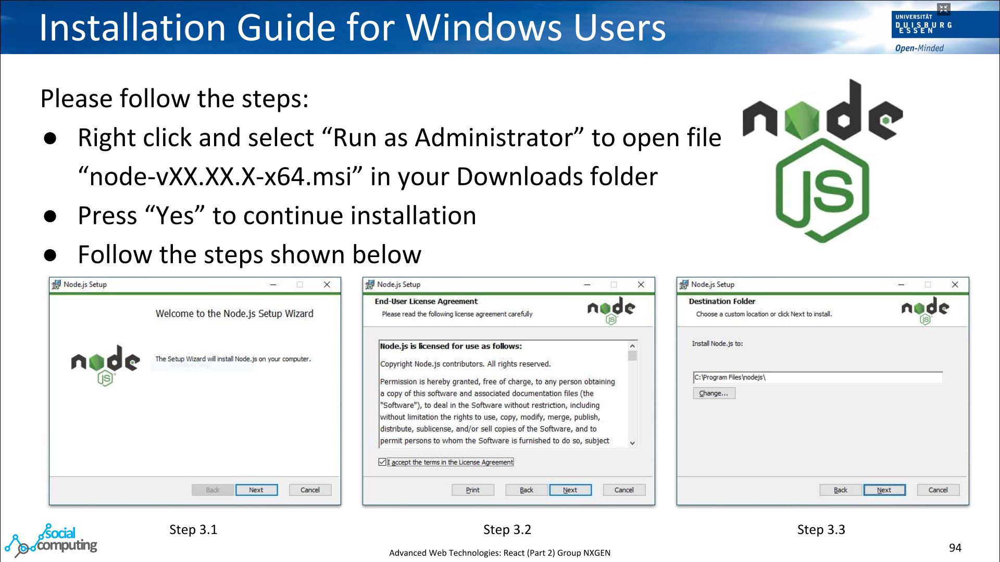
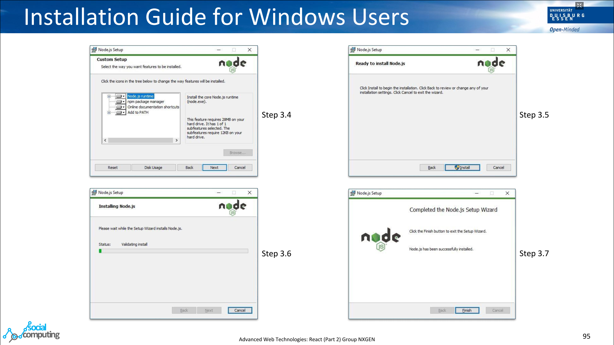
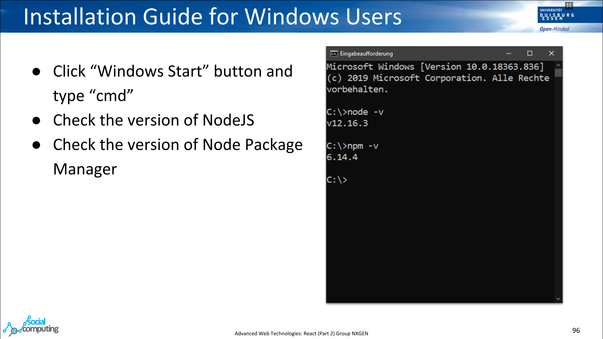
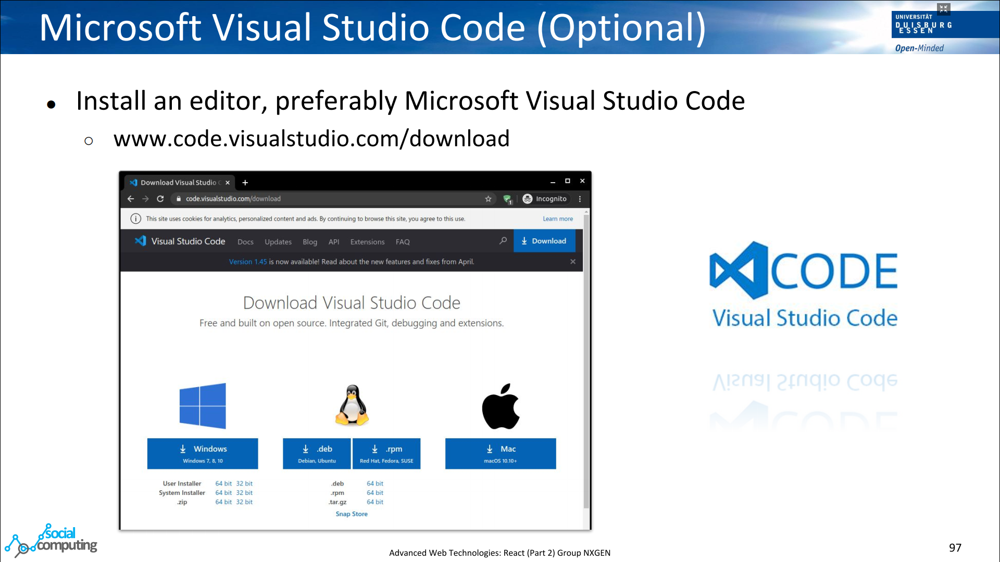
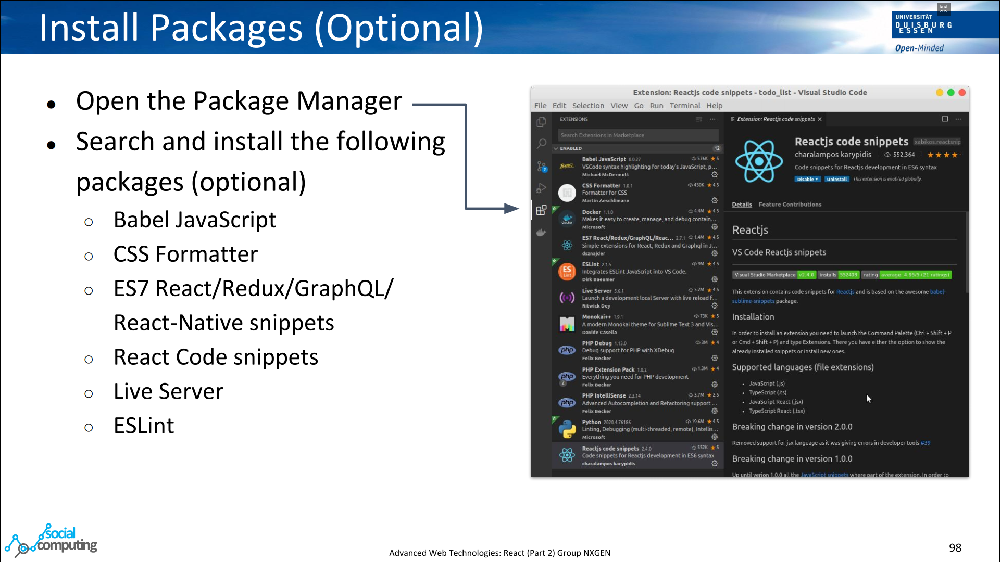
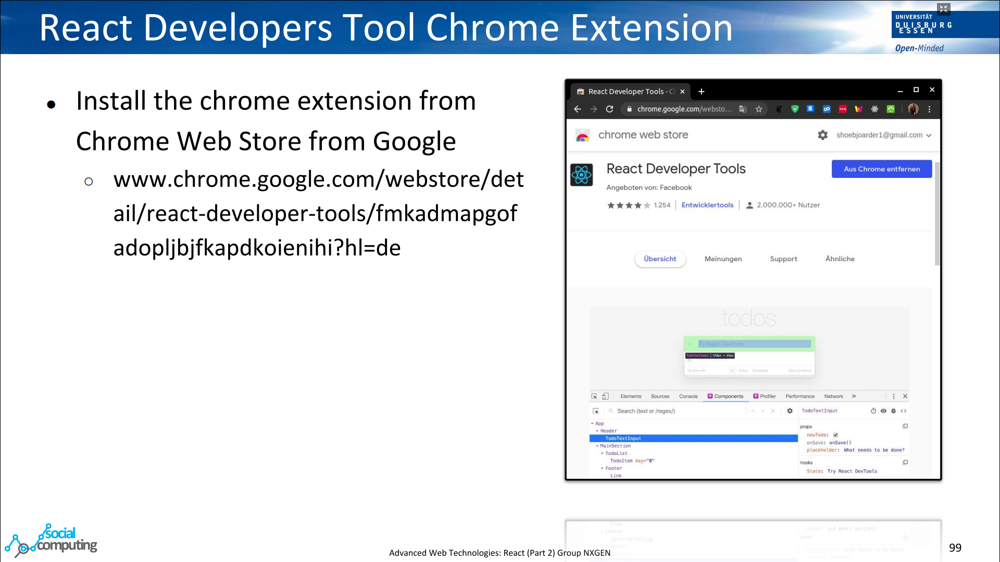

# Installation

1. [Installation of the frontend softwares](#installation-of-the-frontend-softwares)
    *   [NodeJS in Windows](#nodejs-in-windows)
    *   [NodeJS in Linux](#nodejs-in-Linux)
2. [Installation of the backend softwares](#installation-of-the-backend-softwares)
    *   [Python in Windows](#python-in-windows)
    *   [MongoDB](#mongodb)
3. [Installation of additional softwares](#installation-of-additional-softwares)
    *   [Visual Studio Code](#visual-studio-code)
    *   [React Development Tools](#react-development-tools)
    *   [MongoDB and Mongo Compass](#mongodb-and-mongo-compass)

# Installation of frontend softwares

## NodeJS in Windows

## NodeJS in Linux

Step 1: Open the terminal (Ubuntu: Ctrl + Alt + t).

Step 2: Update and upgrade the machine.

    $ sudo apt-get update
    $ sudo apt-get upgrade -y

Step 3: Install NodeJS.

    $ curl -sL https://deb.nodesource.com/setup_10.x -o nodesource_setup.sh

Step 4: Run the bash file.

    $ sudo bash nodesource_setup.sh

Step 5: Install NodeJS.

    $ sudo apt install nodejs

Step 6: Check versions of node and npm.

    $ node -v
    v12.18.1

    $ npm -v
    6.14.5

# Installation of backend softwares

## Python in Windows

Copy the link below and paste it in the browser.

    https://www.python.org/ftp/python/3.8.5/python-3.8.5-amd64.exe

Install Python after successfully downloading the file.

# Installation of additional softwares

## Visual Studio Code

Download Visual Studio Code

    https://code.visualstudio.com/download

## React Development Tools

Install a chrome extension for React.

    https://chrome.google.com/webstore/detail/react-developer-tools/fmkadmapgofadopljbjfkapdkoienihi?hl=de

## MongoDB and Mongo Compass

Download the MongoDB for Windows OS from the link below.

    https://www.mongodb.com/try/download/community

Run the installation file including the compass.

For Linux user, follow the steps below.

Step 1: Update the machine

    $ sudo apt-get update && sudo apt-get upgrade -y

Step 2: Install MongoDB

    $ sudo apt install -y mongodb

Step 3: Check the status of the service

    $ sudo systemctl status mongodb

Step 4: If the service is not running, run the mongodb service

    $ sudo systemctl start mongodb

You can install the MongoDB Compass from the Ubuntu Store.